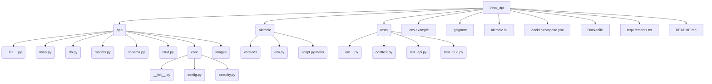

# Bee API Specification

## 1. Introduction

This document outlines the specification for Bee API, a GraphQL API for tracking bee information. It is built using Python, FastAPI, Strawberry, SQLAlchemy, and PostgreSQL, and is designed to be run using Docker.

## 2. Technology Stack

*   **Language:** Python 3.12+
*   **Web Framework:** FastAPI
*   **GraphQL Library:** Strawberry
*   **ORM:** SQLAlchemy
*   **Database:** PostgreSQL
*   **Migrations:** Alembic
*   **Testing:** Pytest
*   **Containerization:** Docker &amp; Docker Compose
*   **Linting/Formatting:** (Optional but recommended: Black, Flake8, isort)

## 3. Proposed Project Structure



*   `app/`: Contains the core FastAPI application code.
    *   `core/`: Core components like configuration loading and security.
    *   `images/`: Directory for storing uploaded bee images (mounted as a volume).
    *   `crud.py`: Database create, read, update, delete operations.
    *   `db.py`: Database session management.
    *   `main.py`: FastAPI application instance and router setup.
    *   `models.py`: SQLAlchemy database models.
    *   `schema.py`: Strawberry GraphQL schema definitions.
*   `alembic/`: Alembic migration scripts and configuration.
*   `tests/`: Pytest unit and integration tests.
*   `.env.example`: Example environment variable file.
*   `.gitignore`: Standard Python gitignore.
*   `alembic.ini`: Alembic configuration file.
*   `docker-compose.yml`: Docker Compose configuration for services (app, db).
*   `Dockerfile`: Instructions for building the application's Docker image.
*   `requirements.txt`: Python package dependencies.
*   `README.md`: This specification file.

## 4. Database Schema (PostgreSQL)

The application will use a PostgreSQL database with the following table, defined using SQLAlchemy models in `app/models.py`.

**`bee` Table:**

| Column        | Type         | Constraints              | Description                     |
|---------------|--------------|--------------------------|---------------------------------|
| `id`          | `INTEGER`    | Primary Key, Autoincrement | Unique identifier for the bee   |
| `name`        | `VARCHAR`    | Not Null                 | Name of the bee                 |
| `origin`      | `VARCHAR`    | Not Null                 | Geographic origin of the bee    |
| `image_path`  | `VARCHAR`    | Nullable                 | Relative path to the bee image  |
| `species`     | `VARCHAR`    | Not Null                 | Species of the bee              |
| `captured_date`| `DATE`       | Not Null                 | Date the bee was captured       |

```python
# Example SQLAlchemy Model (in app/models.py)
from sqlalchemy import Column, Integer, String, Date
from sqlalchemy.orm import declarative_base

Base = declarative_base()

class Bee(Base):
    __tablename__ = "bee"

    id = Column(Integer, primary_key=True, index=True)
    name = Column(String, nullable=False)
    origin = Column(String, nullable=False)
    image_path = Column(String, nullable=True) # Store relative path like 'images/bee1.jpg'
    species = Column(String, nullable=False)
    captured_date = Column(Date, nullable=False)
```

## 5. API Specification (GraphQL)

*   **Endpoint:** `/graphql`
*   **Authentication:** JWT-based authentication. Include the JWT token in the `Authorization` header with the format `Bearer {token}`.

**Types:**

*   **`BeeType`**:
    *   `id: Int!`
    *   `name: String!`
    *   `origin: String!`
    *   `image_path: String` (Nullable, relative path)
    *   `species: String!`
    *   `captured_date: Date!`

*   **`UserType`**:
    *   `id: Int!`
    *   `username: String!`
    *   `email: String!`
    *   `is_active: Boolean!`

*   **`TokenType`**:
    *   `access_token: String!`
    *   `token_type: String!`

**Queries:**

*   `bees: [BeeType!]!`
    *   Returns a list of all bees.
    *   Requires authentication.
*   `bee(id: Int!): BeeType`
    *   Returns a single bee by its ID.
    *   Returns `null` if not found.
    *   Requires authentication.
*   `me: UserType!`
    *   Returns the currently authenticated user's information.
    *   Requires authentication.

**Mutations:**

*   `register(username: String!, email: String!, password: String!): UserType!`
    *   Registers a new user.
    *   Returns the newly created user.
    *   Does not require authentication.

*   `login(username: String!, password: String!): TokenType!`
    *   Authenticates a user and returns a JWT token.
    *   Returns the access token and token type.
    *   Does not require authentication.

*   `addBee(name: String!, origin: String!, species: String!, captured_date: Date!, image: Upload): BeeType!`
    *   Adds a new bee to the database.
    *   Handles optional image upload (`strawberry.file_uploads.Upload`).
    *   Saves the image to the `app/images` directory.
    *   Stores the relative image path in the `image_path` field.
    *   Returns the newly created `BeeType`.
    *   Requires authentication.

*   `deleteBee(id: Int!): Boolean!`
    *   Deletes a bee by its ID.
    *   Also deletes the associated image file from the filesystem if it exists.
    *   Returns `true` if successful, `false` otherwise.
    *   Requires authentication.

## 6. Configuration

Application configuration will be managed via environment variables, loaded using a Pydantic settings model in `app/core/config.py`. A `.env` file (copied from `.env.example`) should be used for local development.

**Required Environment Variables:**

*   `DATABASE_URL`: PostgreSQL connection string (e.g., `postgresql+asyncpg://user:password@db:5432/beesdb`)
*   `JWT_SECRET_KEY`: Secret key for signing JWT tokens.
*   `JWT_ALGORITHM`: Algorithm used for JWT tokens (e.g., `HS256`).
*   `POSTGRES_USER`: Username for the PostgreSQL database.
*   `POSTGRES_PASSWORD`: Password for the PostgreSQL database.
*   `POSTGRES_DB`: Name of the PostgreSQL database.

## 7. Authentication

Authentication is handled via JWT tokens.
*   A secret `JWT_SECRET_KEY` and `JWT_ALGORITHM` are defined via environment variables.
*   A FastAPI dependency (`app/core/security.py`) validates the JWT token included in the `Authorization` header.
*   If the token is missing or invalid, a 401 Unauthorized error is returned.

## 8. Database Migrations

Database schema changes are managed using Alembic.
*   Configuration is in `alembic.ini` and `alembic/env.py`.
*   **Generate a new migration:** `docker-compose exec app alembic revision --autogenerate -m "Description of changes"`
*   **Apply migrations:** `docker-compose exec app alembic upgrade head`

## 9. Testing

The project must include automated tests using `pytest`.
*   **Unit Tests:** Test individual functions and classes (e.g., CRUD operations in `app/crud.py`) in isolation. Place in `tests/`. Mock database interactions where necessary.
*   **Integration Tests:** Test the GraphQL API endpoints. Place in `tests/test_api.py`. Use `httpx` and `pytest-asyncio`. Tests should run against a separate test database managed via fixtures (`tests/conftest.py`).

## 10. Containerization

The application and its database dependency are containerized using Docker and Docker Compose.

*   **`Dockerfile`**:
    *   Uses an official Python base image.
    *   Sets up a working directory.
    *   Installs Python dependencies from `requirements.txt`.
    *   Copies application code into the image.
    *   Specifies the command to run the application using `uvicorn`.
*   **`docker-compose.yml`**:
    *   Defines two services: `app` (FastAPI application) and `db` (PostgreSQL database).
    *   Builds the `app` service using the `Dockerfile`.
    *   Uses the official `postgres` image for the `db` service.
    *   Configures environment variables for both services (passing database credentials and JWT configuration).
    *   Sets up volumes for:
        *   PostgreSQL data persistence (`postgres_data:/var/lib/postgresql/data`).
        *   Uploaded images (`./app/images:/app/images`).
    *   Defines network configuration for services to communicate.
    *   Maps ports (e.g., `8000:8000` for the app).

## 11. Setup and Running

1.  **Clone the repository:** `git clone <repository-url> bees_api`
2.  **Navigate to the directory:** `cd bees_api`
3.  **Create environment file:** `cp .env.example .env`
4.  **Edit `.env`:** Fill in the required environment variables (`DATABASE_URL`, `JWT_SECRET_KEY`, `JWT_ALGORITHM`, `POSTGRES_USER`, `POSTGRES_PASSWORD`, `POSTGRES_DB`). Ensure `DATABASE_URL` points to the `db` service name defined in `docker-compose.yml`.
5.  **Build images:** `docker-compose build`
6.  **Start services:** `docker-compose up -d`
7.  **Apply database migrations:** `docker-compose exec app alembic upgrade head`
8.  **Access API:** The GraphQL API should be available at `http://localhost:8000/graphql` (or the mapped port). Remember to include the `Authorization` header in requests with the format `Bearer {token}`.

## 12. Image Handling

*   Images are uploaded via the `addBee` GraphQL mutation using `multipart/form-data` requests (handled by Strawberry's `Upload` type).
*   Uploaded images are saved to the `./app/images` directory within the container.
*   This directory is mounted as a volume in `docker-compose.yml` to persist images on the host machine.
*   FastAPI is configured to serve static files from the `/images` path, making uploaded images accessible via URLs like `http://localhost:8000/images/<filename>`. The `image_path` stored in the database will be the relative path used for this URL (e.g., `images/bee1.jpg`).